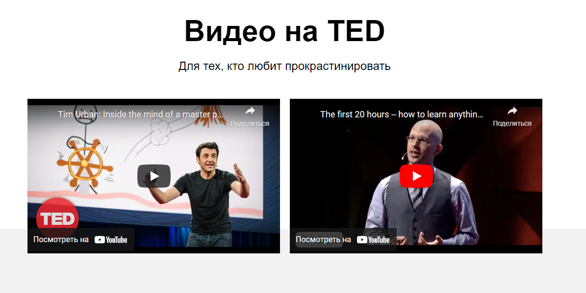

# Научиться учиться
  ---
  Научиться учиться-это верный помощник в обучении.
  В проекте выделены главные проблемы в обучении, а так же приведены техники и методы,  благодаря которым процесс обучения станет легче:
  * Практики Барабары Оакли (американский учёный, переводчик, профессор инженерного дела в Оклендском университете).
  * Метод Фейнмана (американский учёный. Основные достижения относятся к области теоретической физики. Один из создателей квантовой электродинамики).
  * Принципы обечения от Джоша Кауфмана (современный американский писатель, бизнес-тренер, автор деловой литературы.).
  * Ссылки на дополнительные источники и литературу [книга Весь мир-школа](./images/khan-book.jpg)
 
 Для любителей прокрастинировать, проект содержит видео фрагменты. 
 
 ____
## CSS
* Файловая структура CSS организована по методологии БЭМ.
* Некоторые элименты проекта анимированы с помощью CSS свойств.
* Все ссылки на странице при наведении мы меняют прозрачность

